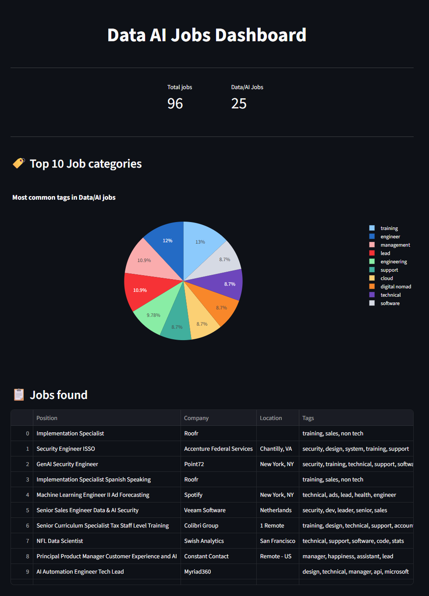

# 💼 Data & AI Jobs Dashboard

Ein interaktives Streamlit-Dashboard zur Visualisierung und Analyse von Data- und AI-Jobs aus der RemoteOK API.


## 📋 Inhaltsverzeichnis

- [Über das Projekt](#über-das-projekt)
- [Features](#features)
- [Demo](#demo)
- [Installation](#installation)
- [Verwendung](#verwendung)
- [Technologien](#technologien)
- [Projekt-Struktur](#projekt-struktur)
- [API-Informationen](#api-informationen)
- [Mögliche Erweiterungen](#mögliche-erweiterungen)
- [Learnings](#learnings)
- [Kontakt](#kontakt)
- [Lizenz](#lizenz)

## 🎯 Über das Projekt

Dieses Projekt ist ein **interaktives Dashboard** zur Exploration des Data- und AI-Jobmarktes. Es nutzt die RemoteOK API, um aktuelle Remote-Jobs zu laden, filtert diese nach relevanten Keywords und visualisiert die Ergebnisse übersichtlich.

**Motivation:** Als angehender Data-Professional wollte ich den Jobmarkt besser verstehen und gleichzeitig praktische Erfahrung mit APIs, Datenvisualisierung und Web-Dashboards sammeln.

## ✨ Features

- 🔍 **Automatische Filterung** - Findet Data/AI-relevante Jobs aus 95+ Remote-Positionen
- 📊 **Interaktive Visualisierungen** - Pie Chart für Top-Kategorien
- 📋 **Übersichtliche Tabelle** - Alle gefilterten Jobs auf einen Blick
- 📈 **Key Metrics** - Schneller Überblick über Anzahl der Jobs
- 🔄 **Live-Daten** - Aktualisiert bei jedem Laden der Seite
- 💻 **Responsive Design** - Wide-Layout für bessere Übersicht

## 🖼️ Demo

### Dashboard-Ansicht


## 🚀 Installation

### Voraussetzungen

- Python 3.9 oder höher
- pip (Python Package Manager)
- Git (optional, zum Klonen)

### Schritt-für-Schritt Anleitung

1. **Repository klonen** (oder als ZIP herunterladen):
   ```bash
   git clone https://github.com/DEIN-USERNAME/data-jobs-dashboard.git
   cd data-jobs-dashboard
   ```

2. **Virtual Environment erstellen** (empfohlen):
   
   **Windows:**
   ```bash
   python -m venv venv
   venv\Scripts\activate
   ```
   
   **Mac/Linux:**
   ```bash
   python3 -m venv venv
   source venv/bin/activate
   ```

3. **Dependencies installieren:**
   ```bash
   pip install -r requirements.txt
   ```

4. **Dashboard starten:**
   ```bash
   streamlit run app.py
   ```

5. **Browser öffnen:**
   - Das Dashboard öffnet sich automatisch unter `http://localhost:8501`
   - Falls nicht, öffne den Link manuell im Browser

## 💡 Verwendung

### Dashboard-Funktionen

1. **Key Metrics (oben)**
   - Zeigt die Gesamtanzahl aller Jobs
   - Zeigt gefilterte Data/AI-Jobs

2. **Top 10 Job-Kategorien (Pie Chart)**
   - Visualisiert die häufigsten Tags in Data/AI-Jobs
   - Interaktiv: Hover für Details

3. **Job-Tabelle**
   - Alle gefilterten Jobs mit Position, Company, Location, Tags
   - Scrollbar bei vielen Einträgen
   - Sortierbar durch Klick auf Spaltenüberschriften

### Filter-Keywords

Das Dashboard filtert Jobs nach folgenden Keywords:
- `data`
- `ai`
- `machine learning`
- `ml`

Jobs werden gefunden, wenn diese Keywords in:
- Position/Job-Titel
- Tags

vorkommen.

## 🛠️ Technologien

| Technologie | Verwendung |
|------------|-----------|
| **Python 3.14.2** | Programmiersprache |
| **Streamlit 1.54.0** | Web-Dashboard Framework |
| **Plotly Express** | Interaktive Visualisierungen |
| **Requests** | API-Calls |
| **Collections (Counter)** | Daten-Aggregation |

## 📁 Projekt-Struktur

```
data-jobs-dashboard/
│
├── app.py                 # Haupt-Dashboard-Anwendung
├── requirements.txt       # Python-Dependencies
├── README.md             # Diese Datei
├── .gitignore            # Git-Ignore-Regeln
└── venv/                 # Virtual Environment (lokal)
```

## 🌐 API-Informationen

### RemoteOK API

- **Endpoint:** `https://remoteok.com/api`
- **Typ:** REST API
- **Authentifizierung:** Keine (öffentlich)
- **Rate Limit:** Fair Use (nicht spammen)
- **Datenformat:** JSON

**Beispiel-Response:**
```json
{
  "id": "123456",
  "position": "Data Scientist",
  "company": "Example Corp",
  "location": "🌍 Worldwide",
  "tags": ["data", "python", "remote"],
  "url": "https://remoteok.com/remote-jobs/123456"
}
```

**Hinweis:** Die API liefert hauptsächlich Job-Kategorien als Tags (z.B. "engineer", "senior"), weniger technische Skills (z.B. "python", "pandas").

## 📝 Lizenz

Dieses Projekt steht unter der MIT License - siehe [LICENSE](LICENSE) Datei für Details.
